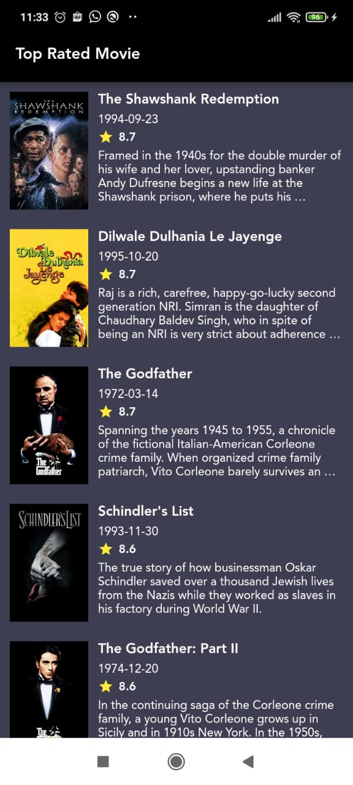

# Movie App

Movie App menggunakan teknik caching via interceptor pada GetConnect,aplikasi
ini dibuat menggunakan State Management Getx menggunakan Obx
untuk update Widget UInya

Aplikasi dibuat menggunakan Flutter versi 2.10.5

pada aplikasi menggunakan Flavor,disini ada jenis 3 Flavor yaitu UAT,DEV, PROD

untuk menjalankan aplikasi gunakan perintah :

- versi DEV  : flutter run --flavor dev lib/main_dev.dart
- versi UAT  : flutter run --flavor uat lib/main_uat.dart
- versi PROD : flutter run --flavor prod lib/main.dart

 Selamat Mempelajari dan semoga bermanfaat :D

 Screen Shoot Aplikasi
 
 

